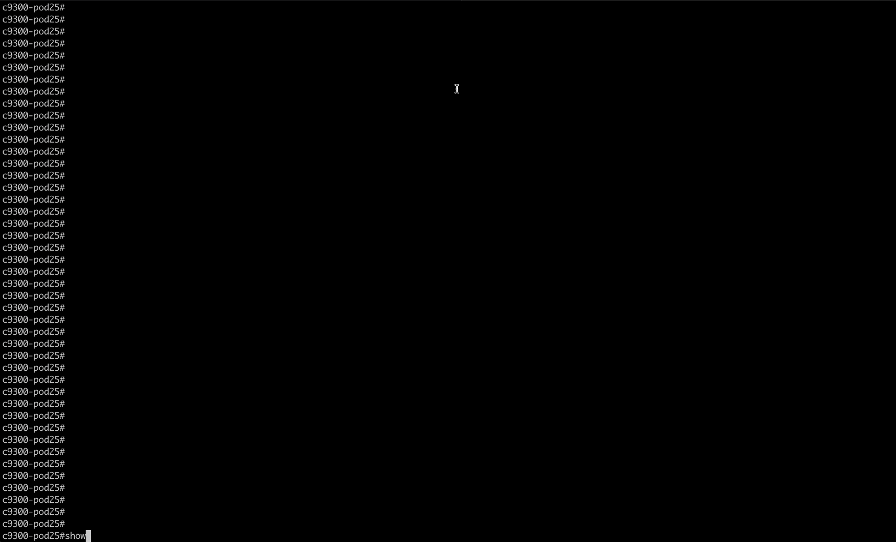

# CLI2YANG
In Cisco IOS XE Cupertino 17.7.1 and later releases, you can automatically translate IOS commands into relevant NETCONF-YANG XML or RESTCONF-JSON request messages. You can analyze the generated configuration messages and familiarize with the Xpaths used in these messages. The generated configuration in the structured format can be used to provision other devices in the network; however, this configuration cannot be modified.

## Retrieve running config on the device in CLI
Review the CLI running configuration

1. Review the running configuration in the good ole fashioned CLI using `show run`


## Retrieve running config formatted in XML for NETCONF
Generate the XML of the current running config using `netconf-xml`


## Retrieve run config formatted with JSON for RESTCONF
Generate the JSON of the current running config using  `restconf-json`




## Update the running-config with a script
Update the config

1. `[guestshell@guestshell ~]$ netconf-format > config.before` (this will take a few seconds to complete).
2. Escape from the c9300 using `[guestshell@guestshell ~]$ exit`.
3. Escape from the c9300 using `c9300# exit`.
4. Run the script by running the command `auto@pod5-xelab:~$ cd ~/cli2yang ; ./update-config.sh`.
5. What is the printed flag (a hashed string) when updating the configuration through the script above?

## Compare differences in the config
How many lines of config have changed after running `./cli2yang/update-config.sh`?

1. Run the following commands from the Guest Shell prompt.
  If you are not already connected to the switch, then connect with: `telnet c9300`.
  Then enter the Guest Shell from the C9300 prompt with: `guestshell`.
  
  ```
  [guestshell@guestshell ~]$ netconf-format > config.after (this will take a few seconds to complete)
  [guestshell@guestshell ~]$ diff config.before config.after | wc -l  (Use diff again while using line count tool)
  ```

## Review the config that changed
Run the following to see the changes in the config:
```
[guestshell@guestshell ~]$ diff config.before config.after
```
There is a short amount of output and the final line is the flag, including the open and closing brackets `<` and `>`.

1. Determine which feature was added by running `[guestshell@guestshell ~]$ diff config.before config.after`.

## Which IOS feature did the script add?
After running the `update-config.sh` script, notice the new config that was added. What is the feature found using 
the `GET` method? Note: `update-config.sh` applies the changes in `terraform.tf`.