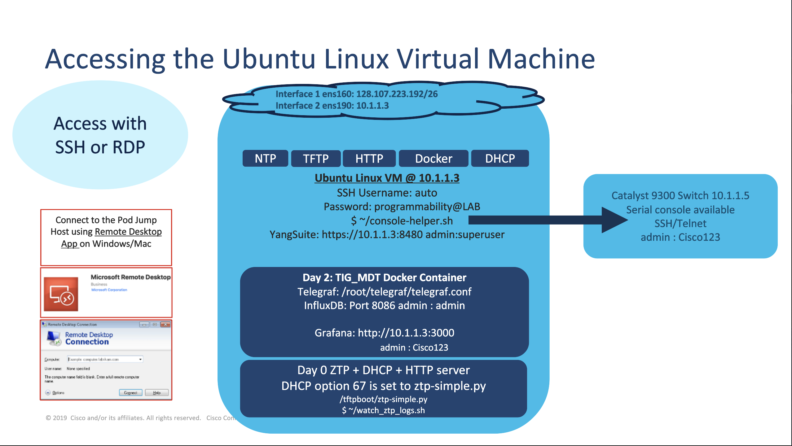
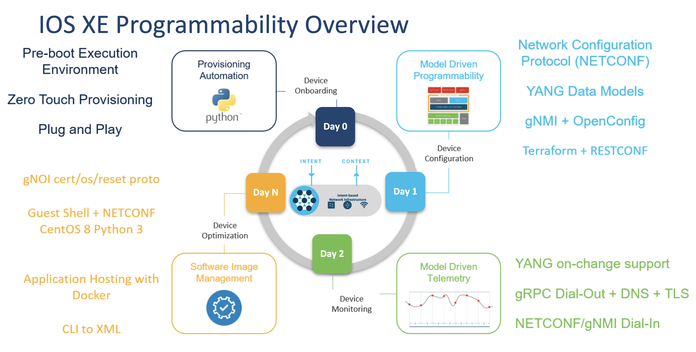

# Welcome to the Cisco IOS XE Programmablity Lab

## Version 17.7 SEVT

[Looking for the previous version of the lab?](https://github.com/jeremycohoe/cisco-ios-xe-programmability-lab)

# Lab Topology
To access the lab, you will need to use a Remote Desktop connection to the specific jump host. The jump host is used to allow remotes access into all lab devices within the given pod envrionment.

Please refer to the IOS XE Programambility Lab Acess Sheet for specific pod access instructions and details

The services, features, and technologies that are enabled with the lab envrionment are shown below:

The modules below enable IOS XE Device Lifecycle Management:

# Lab Modules

Lab modules can be completed in any order. Mark the lab completed in the SmartSheet form once you have successfully completed each module to receive SEVT learning credits when appropriate. 

## YANG Suite

[YANG Suite Module](YANGSuite.md)

## Terraform

[Terraform Module](Terraform.md)

## CLI to YANG

[CLI to YANG Module](CLI2YANG.md)

## gNOI reset.proto

[gNOI reset.proto Module](gNOI_reset_proto.md)

