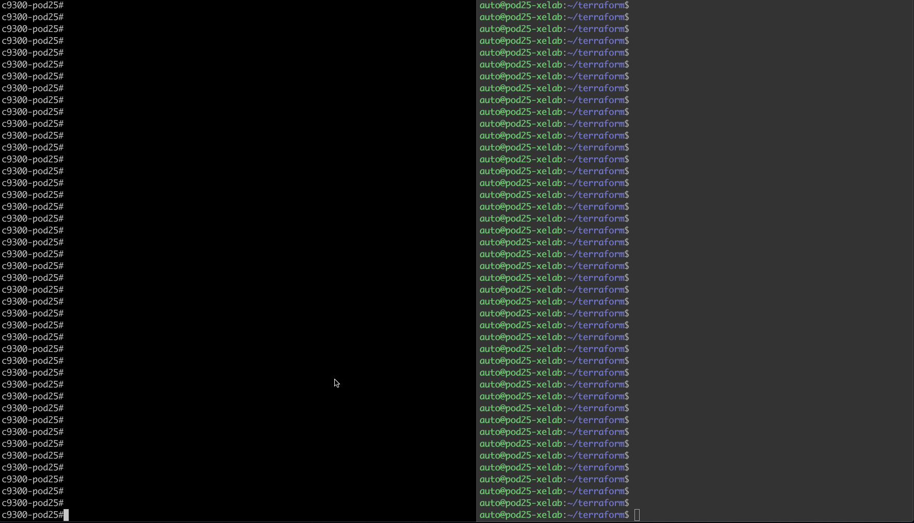
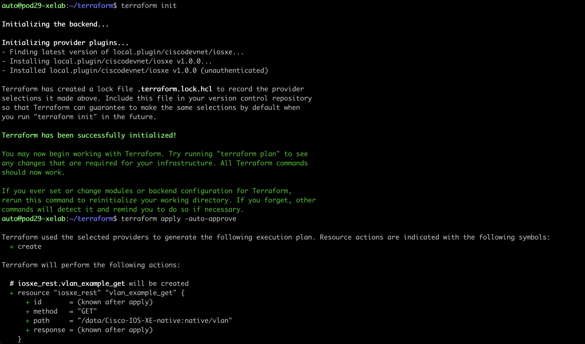
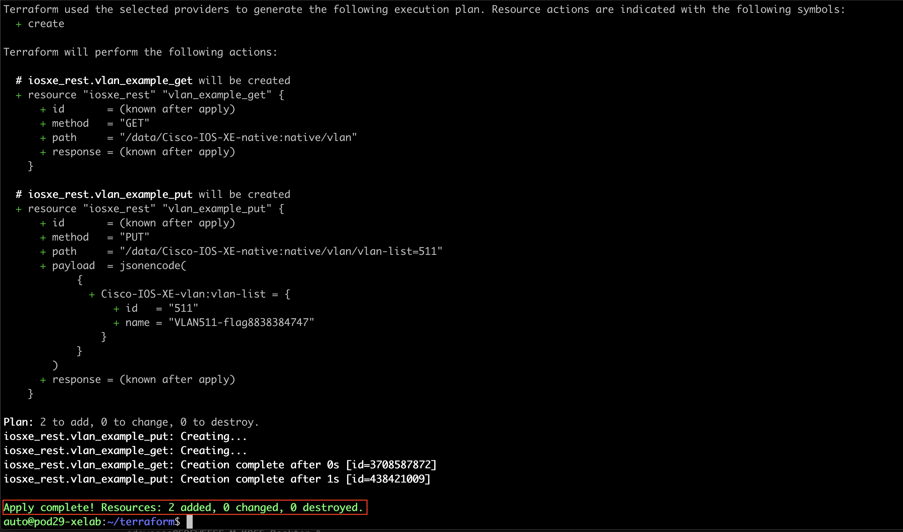

# Terraform

[Terraform](https://www.terraform.io) is a cloud native, open-source infrastructure provisioning tooling similar to Ansible. IOS XE Terraform utilizes RESTCONF + YANG to configure devices using a single binary file. Terraform is declarative, meaning that it defines the desired state. It has commercial support from HashiCorp.

Terraform providers communicate with the desired resource. Typically, there are one or more resources in a .tf file.

Terraform is installed using the “apt” package management system. Running the Debian Package command, or dpkg, with the -L flag (list) shows which packages are installed on the system, including the Terraform tool.

1. Add the terraform.tf file to your device to configure a switch.

### terraform.tf
```
terraform {
  required_providers {
    iosxe = {
      source = "local.plugin/ciscodevnet/iosxe"
    }
  }
}

provider "iosxe" {
  host = "https://10.1.1.5"
  insecure = true
  device_username = "admin"
  device_password = "Cisco123"
}

resource "iosxe_rest" "vlan_example_put" {
  method = "PUT"
  path = "/data/Cisco-IOS-XE-native:native/vlan/vlan-list=511"
  payload = jsonencode(
    {
    "Cisco-IOS-XE-vlan:vlan-list": {
          "id": "511",
          "name": "VLAN511-flag8838384747"
      }
    }
  )
}

resource "iosxe_rest" "vlan_example_get" {
  method = "GET"
  path = "/data/Cisco-IOS-XE-native:native/vlan"
}
```

## Apply Terraform
Now that the .tf file has been reviewed and is ready for use, the Terraform tool itself can be initialized and then used to apply this configuration



1. Initialize Terraform with `terraform init`
1. Apply the configuration with the terraform apply command `terraform apply -auto-approve`


1. Note that the terraform provider has been executed if the message appears "Apply complete! Resources: 2 added, 0 changed, 0 destoyed."
