# YANG Suite
[YANG Suite](https://github.com/CiscoDevNet/yangsuite) is HTML5 based tooling that is available for working with the YANG based programmable interfaces on Cisco IOS XE, XR, and NX Network Operating Systems. It has plugins that allow for interacting with the programmable interfaces and supports downloading YANG files directly from network devices. In this module, we will explore using NETCONF and RESTCONF to configure a switch and we will create a gRPC telemetry subscriptions.

## NETCONF: GET Interface Descriptions 
Using NETCONF, make an API call to the C9300 device to determine the description of an interface.

1. Login to the pod using RDP <br />
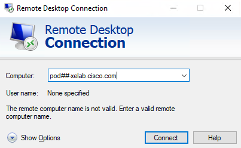

1. Within the pod, navigate to http://localhost:8480 or select the short cut in the Firefox browser
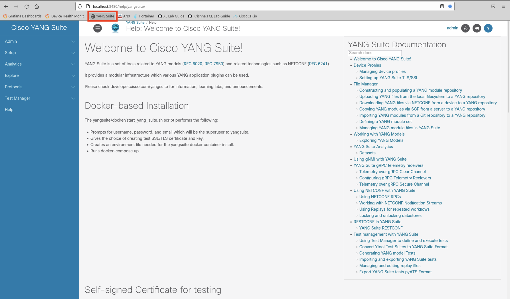

1. Select the following in YANG Suite
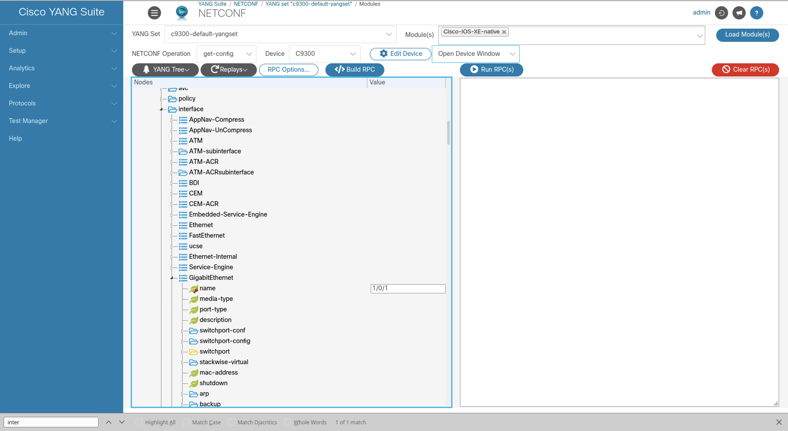

    1. Protocol: “NETCONF”
    1. YANG Set: “c9300-default-yangset”
    1. Modules: “Cisco-IOS-XE-native” (note: start typing "native" to filter through the options in the dropdown menu)
    1. Click the blue “Load Modules” button
    1. NETCONF Operation: “get-config”
    1. Device: “c9300”
    1. Wait for the tree to appear in the grey box on the left. (note: if you get an Error 500 popup, it's because the tree has not yet loaded. The tree must be loaded for the following steps. It takes a few minutes for the Native YANG module to load, wait a minute until the tree view is loaded)
    1. Once the YANG tree is created, select "interface" (note: select CONTROL + F to find "interface" on the page)
    1. From within the "interface" dropdown, select "GigabitEthernet" (note: select CONTROL + F to find "GigabitEthernet" on the page)
    1. In the name section under "GigabitEthernet", add “1/0/1”
1. Click the blue "Build RPC" button
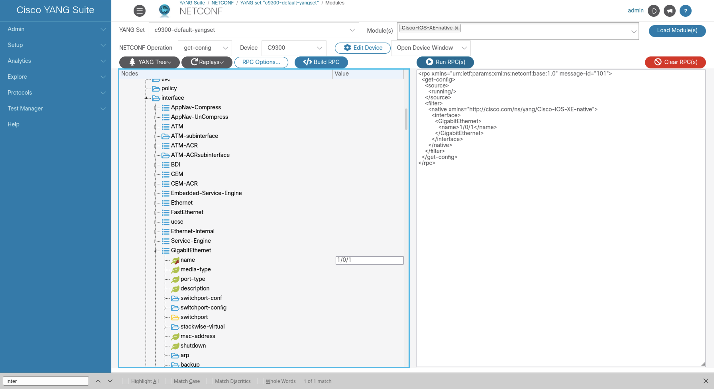

1. Click the blue "Run RPC(s)" button
1. In the new tab that's opened, notice the description of GigabitEthernet1/0/1 has changed. (note: you may need to scroll up)

## NETCONF: UPDATE interface (shutdown)
Make an API call that edits the interface to “shutdown”. (note: If you've completed the NETCONF GET task above, you can skip to step 1.5 below)

1. Select the following in YANG Suite:
    1. Protocol: “NETCONF”
    1. YANG Set: “c9300-default-yangset”
    1. Modules: “Cisco-IOS-XE-native”
    1. Click “Load Modules”
    1. NETCONF Operation: “edit-config”
    1. Device: “c9300”
    1. Once the YANG tree is created, select "interface" (note: select CONTROL + F to find "interface" on the page)
    1. From within the "interface" dropdown, select "GigabitEthernet" (note: select CONTROL + F to find "GigabitEthernet" on the page)
    1. In the name section under "GigabitEthernet", add “1/0/2”
    1. Select the checkbox next to “shutdown”
    1. If there is previous RPC in the RPC window, select "Clear RPC"
    1. Select “Build RPC”
    1. Select “Run RPC”
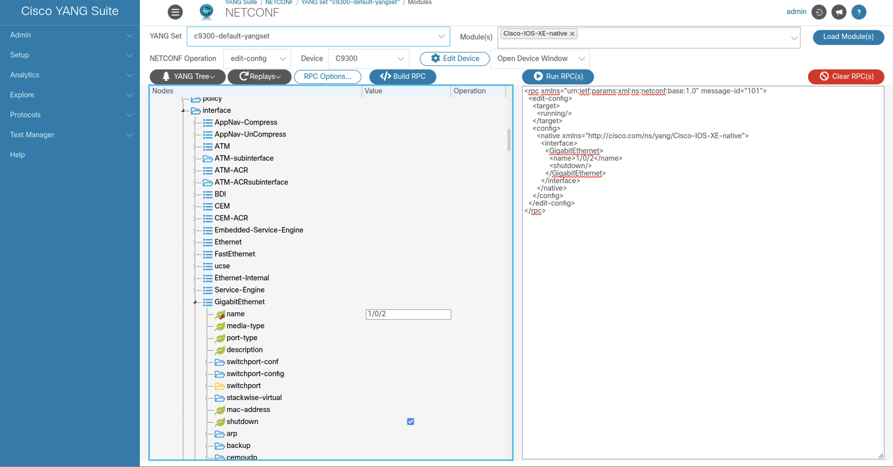

## NETCONF: GET Loopback0
Make an API call to get the Loopback0.

1. Protocol: "NETCONF"
1. YANG Set: "c9300-default-yangset"
1. Modules: "Cisco-IOS-XE-native"
1. Click the blue "Load Modules" button
1. NETCONF Operation: "get-config"
1. Device: "c9300"
1. Clear all of the currently selected values in the tree by selecting the "YANG tree" button and from the dropdown, select "Clear Values and Operations"
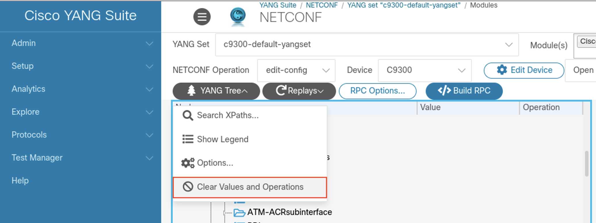

1. Once the YANG tree is created, select "interface" (note: select CONTROL + F to find "interface" on the page)
1. From within the "interface" dropdown, select "Loopback" (note: select CONTROL + F to find "Loopback" on the page)
1. In the name section under "Loopback", add “0”
1. Click the red "Clear RPC(s)" button
1. Click the blue "Build RPC" button
1. Click the blue "Run RPC(s)" button
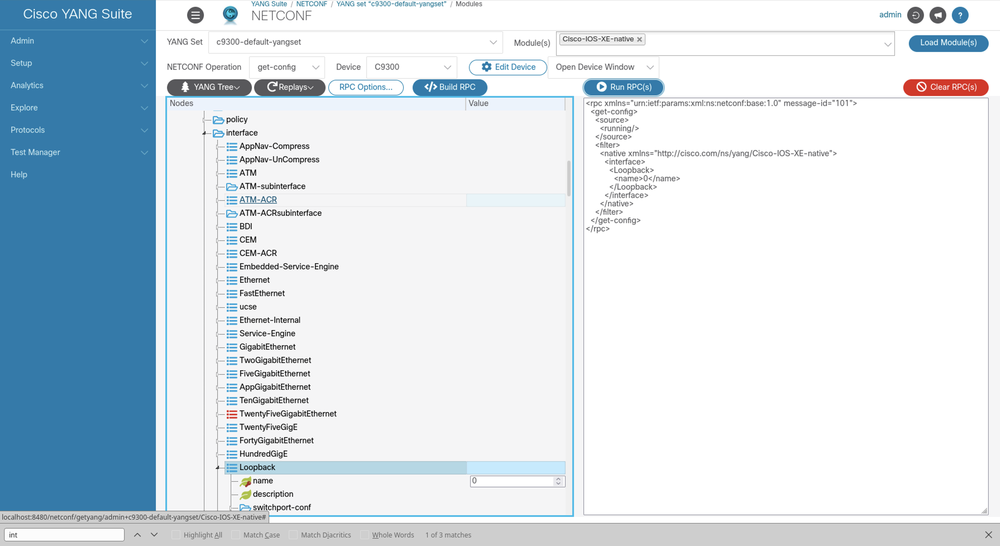

## NETCONF: Update Interface Description
Make an API call that edits the Loopback0 interface description.

1. Protocol: “NETCONF”
1. YANG Set: “c9300-default-yangset”
1. Modules: “Cisco-IOS-XE-native”
1. Click “Load Modules”
1. NETCONF Operation: “edit-config”
1. Device: “c9300”
1. Once the YANG tree is created, select "interface" (note: select CONTROL + F to find "interface" on the page)
1. From within the "interface" dropdown, select "Loopback" (note: select CONTROL + F to find "Loopback" on the page)
1. In the name section under "Loopback", add “1”
1. elect “description” and add a string of text such as “Configured by YANG Suite”
1. Select “Clear RPC” to remove any previous RPC
1. Select “Build RPC”
1. Select “Run RPC”


## NETCONF: DELETE Interface Description
Make an API call to delete the interface description.

1. Protocol: "NETCONF"
1. YANG Set: "c9300-default-yangset"
1. Modules: "Cisco-IOS-XE-native"
1. Click "Load Modules"
1. NETCONF Operation: "edit-config"
1. Device: "c9300"
1. Once the YANG tree is created, select "interface" (note: select CONTROL + F to find "interface" on the page)
1. From within the "interface" dropdown, select "Loopback" (note: select CONTROL + F to find "Loopback" on the page)
1. In the name section under "Loopback", add “1”
1. Select “Clear RPC” to remove any previous RPC
1. Select “Build RPC”
1. Select “Run RPC”
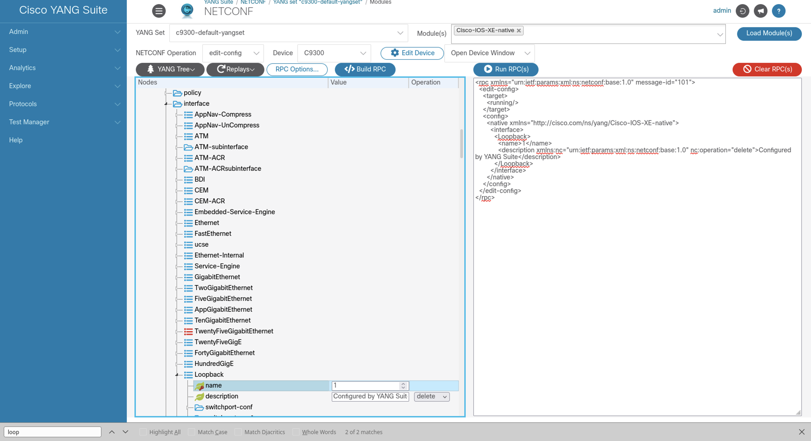

## RESTCONF: GET Loopback Mask
Make an API call to get the interface description.


1. Protocol: “RESTCONF”
1. Select a YANG Set: “c9300-default-yangset”
1. Select a device: “C9300”
1. Select YANG modules: “Cisco-IOS-XE-native”
1. Select depth limit: “2”
1. Select "Load Module(s)"
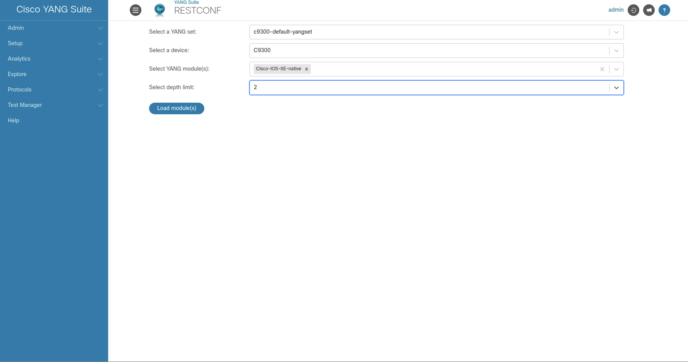

1. Once the tree loads, close the popup that says "Tree generated, please select node(s) to generate API(s)"
1. Expand the tree by selecting the arrow next to “Cisco-IOS-XE-native”
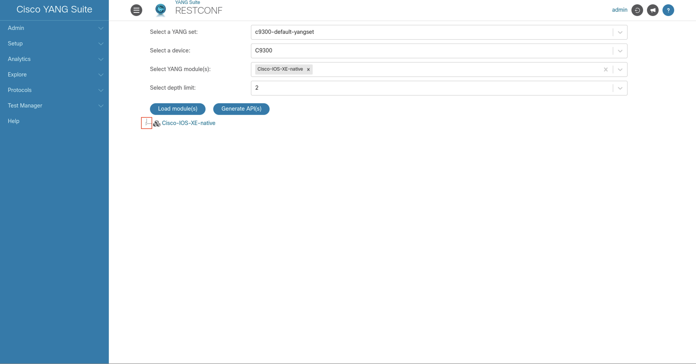

1. Search for “interface” in the expanded tree. (note: select CONTROL + F to find "interface" on the page)
1. Expand “interface” and search for “Loopback" (note: select CONTROL + F to find "Loopback" on the page)
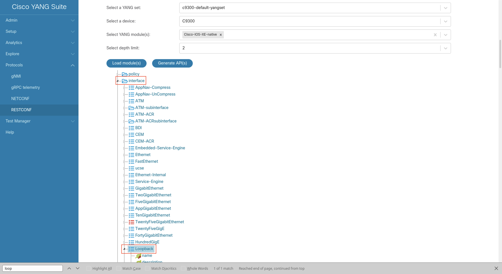

1. Click the blue “Generate API(s)” button. (note: it may take a few moments to load the APIs)
1. Close the popup that says “API(s) are generated”
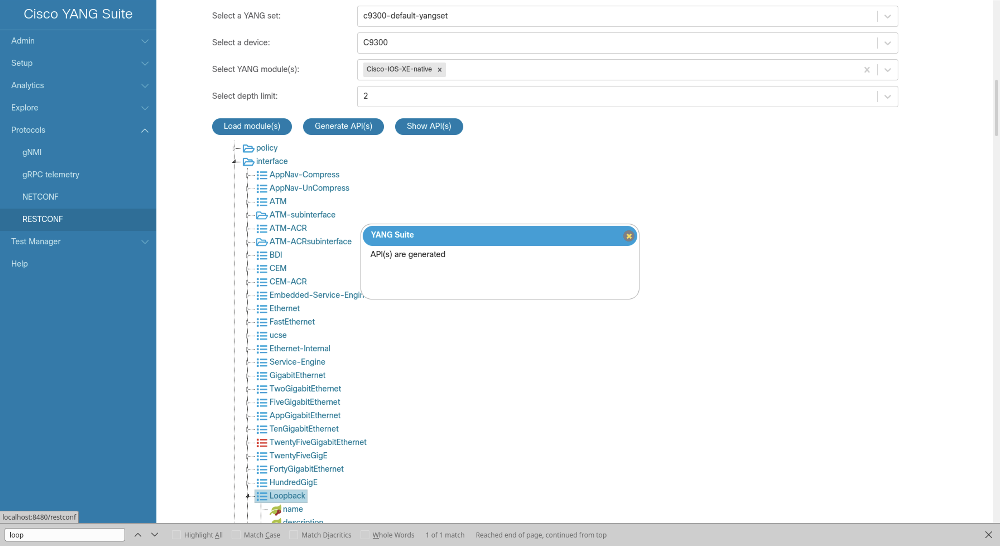

1. Click the blue “Show API(s)” button
1. Select the link next to the "GET" operation
1. Click the "Try it out" button
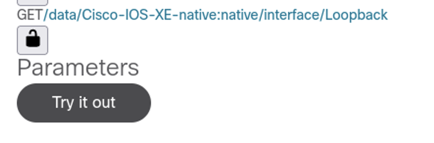
1. Click the "Execute" button to send the RESTCONF payload and view the reply, including the Loopback Netmask
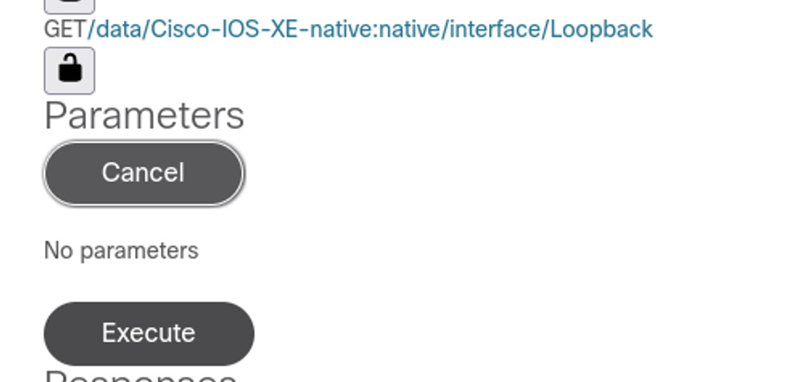

## gRPC subscription
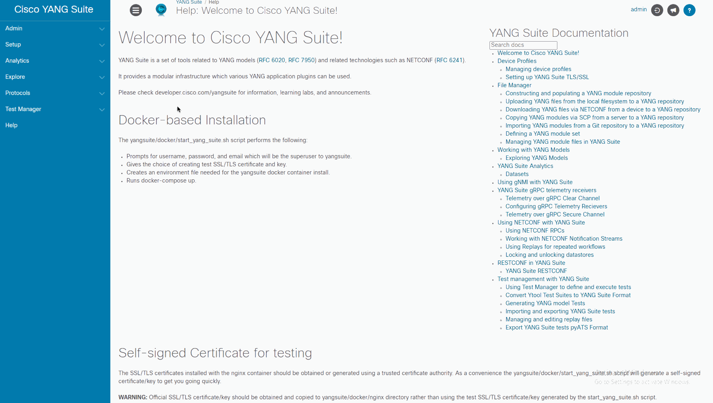

1. In YANG Suite,
    1. Protocol: "gRPC telemetry"
    1. Listen at IP address: “0.0.0.0”
    1. Listen at port: “58500”
    1. Click the “Start receiver” button
    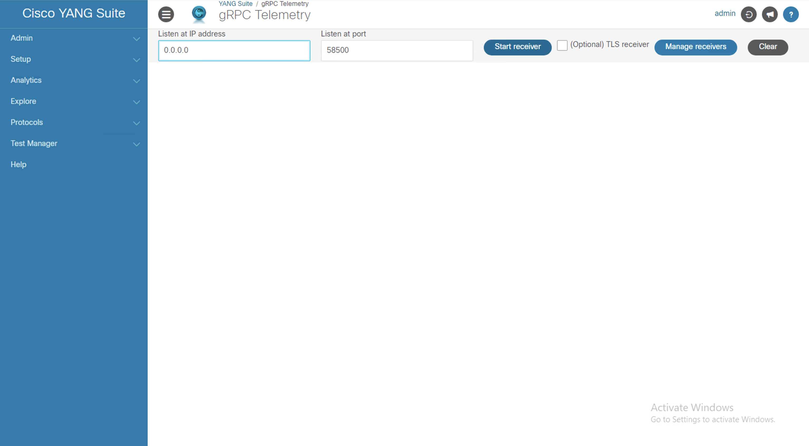
1. On the switch, configure the subscription by copy/pasting the configs:
    ```
    conf t
    telemetry ietf subscription 2011
    encoding encode-kvgpb
    filter xpath /ios:native
    stream yang-push
    update-policy periodic 6000
    receiver-type protocol
    receiver name yangsuite

    telemetry receiver protocol yangsuite
    host name yangsuite-telemetry.cisco.com 58500
    protocol grpc-tcp
    ```
    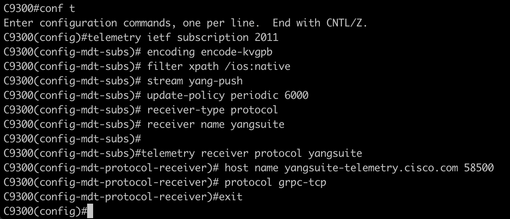

1. Back in YANG Suite, check the telemetry data that should appear at regular intervals on the "gRPC telemetry" screen
1. When the telemetry data begins to flow from the C9300 into YANG Suite, several lines of data will be displayed. Included in this is the timestam, subscription ID, node, path, name, and value fields.
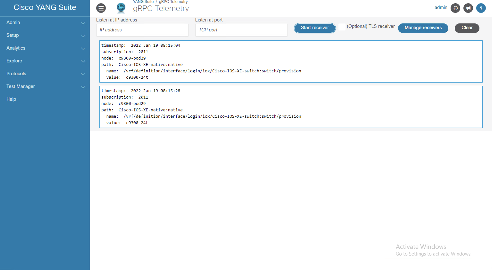


## Learn more about YANG Suite
- [YANG Suite TDM](https://salesconnect.cisco.com/#/content-detail/8cc604e2-8903-4164-a4c4-24007b5d9735)
- [YouTube Demo](https://youtu.be/smrhjL5Ayz0)
